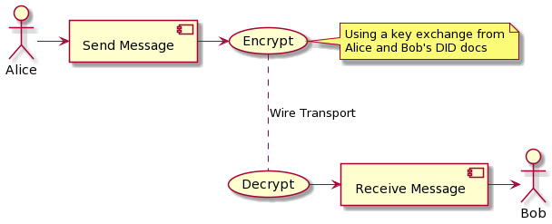
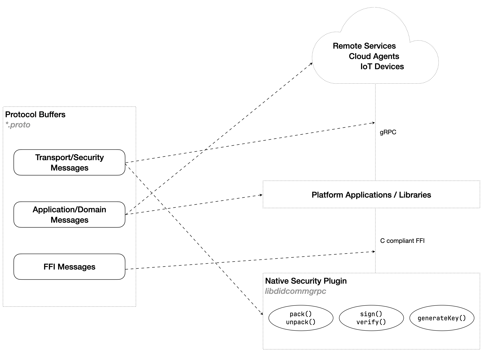

# DIDComm Extension for gRPC

Implementation and message definition for extending DIDComm Messaging v2 using binary protocol (protobuf) and HTTP/2 transport (gRPC).

[](https://github.com/trinsic-id/didcomm-v2/actions/workflows/build-libs.yml)

## Table of Contents

- [Motivation](#motivation)
  - [Design Approach](#design-approach)
- [Extension Architecture](#extension-architecture)
  - [Native Security Library](#native-security-library)
  - [Other Protocols](#other-protocols)
- [Interface Definition](#interface-definition)
  - [Message Structure](#message-structure)
  - [Message Encryption](#message-encryption)
  - [Message Signing](#message-signing)
- [Endpoints and Transport](#endpoints-and-transport)
  - [HTTP/1.x](#http1x)
  - [HTTP/2 with gRPC](#http2-with-grpc)
  - [Service in DID Document](#service-in-did-document)
- [Supported Platforms](#supported-platforms)
  - [Rust](native/README.md)
  - [.NET](dotnet/README.md)
    - [x] NET Core
    - [x] Xamarin
    - [ ] WebAssembly
  - [Objective C](objc/README.md)
    - [x] Swift
  - [WebAssembly](wasm/README.md)
    - [x] Node
    - [ ] Browser
  - [Python](python/README.md)
  - [Go](go/README.md)
  - Planned
    - [ ] Java
      - [ ] Kotlin
      - [ ] Android
    - [ ] React Native
    - [ ] Dart
- [License](LICENSE)
- [Get Involved](#get-involved) 🙌

---

## Motivation 

[DIDComm Messaging](https://identity.foundation/didcomm-messaging/spec/#purpose-and-scope) provides a secure, private communication methodology built atop the decentralized design of DIDs. The spec defines a concrete message definition using JSON notation, and allows for other protocols to be defined.
This extension of the DIDComm Messaging protocol introduces [Protocol Buffers](https://developers.google.com/protocol-buffers) (Protobuf) as a language defintion for the message contracts.
Protobuf is language-neutral, platform-neutral, extensible mechanism for serializing structured data. In addition, it offers a concrete RPC protocol stack for remote services called gRPC.<br />
Protobuf and gRPC focus on interface definition and code generation to achieve multiplatform, zero-code application architecture. DIDComm Messaging can leverage this to provide availability and interoperability between different platforms.

### Design Approach

In order to extend DIDComm Messaging for use with other protocols, we need to describe the approach taken in the following areas:

- Message contract
- Security layer
- Transport

**Message contracts** in this extension use protocol buffers message descriptors. See the section on [Message Structure](#message-structure) for different message formats.<br />
**Security layer** is written as a cross-platform library in Rust that can perform security related operations, such as message packing, signing, etc. The library publishes a C style interface for invocation by different platforms.<br />
**Transport of messages** is described in the context of HTTP/1.x and HTTP/2 using gRPC. The latter uses protobuf defintion to standardize the endpoints and bootstrap implementations.




*<small>Figure 1: Components of DIDComm exchange</small>*

## Extension Architecture

An important factor in driving DIDComm Messaging adoption is providing libraries for multiple languages. gRPC and Protobuf libraries are already highly available; this extensions provides the missing component in the secutiry layer and packs everything together.



### Native Security Library

This library is built in Rust and avaialble for all architectures. It supports the encryption and signing algorithms [defined](https://identity.foundation/didcomm-messaging/spec/#message-encryption) in the DIDComm Messaging spec. Additionally, it provides basic utility methods for working with `did:key` method, using `ed25519`, `x25519` and `p256` key types.
This libary exposes all functionality through a simple foreign function interface (FFI). All functions exposed have the same method signature:

```rust
pub extern "C" fn didcomm_pack(request: ByteBuffer,
                               response: &mut ByteBuffer,
                               err: &mut ExternError) -> i32 { }

pub extern "C" fn didcomm_sign(request: ByteBuffer,
                               response: &mut ByteBuffer,
                               err: &mut ExternError) -> i32 { }
```

This allows us to use the protobuf encoded payloads as request and response to each interface. By convention, the request and response message types are named after the function. For example, the function `didcomm_generate_key` uses `GenerateKeyRequest` for input and `GenerateKeyResponse` for output message. The corresponding protobuf messages are defined as:

```protobuf
message GenerateKeyRequest {
    bytes seed = 1;
    KeyType key_type = 2;
}
message GenerateKeyResponse {
    Key key = 1;
}
```

All FFI messages are maintained in the [api.proto](proto/api.proto) file.

This approach makes it easy to create and maintain platform specific wrappers. Due to the code generation capabilities of gRPC libraries, these API contracts are instantly available to us in a language idiomatic way:

```js
// JavaScript

let request = {
    keyType: dm.KeyType.x25519,
};

var response = generateKey(request);
```

```swift
// Swift

var request = Didcomm_Messaging_GenerateKeyRequest()
request.keyType = .ed25519

let response = try DIDCommGrpc.generateKey(request: request)
```

```cs
// C#

var request = new GenerateKeyRequest { KeyType = KeyType.P256 };

var response = DIDComm.GenerateKey(request);
```

### Other Protocols

This architecture is general enough that it can easily accomodate other protocols. For example, [Thrift](https://thrift.apache.org) and [Avro](https://avro.apache.org/docs/1.3.0/) take very similar approach to interface definitions and RPC service support; it would be fairly trivial to write plugin or separate extension to support them. While CBOR is schemaless serialization format, it can also be used in conjuction with any data modeling solution like [YANG](https://tools.ietf.org/html/draft-ietf-core-yang-cbor-13), though this is not required.

## Data Contract Definition

All data contracts used in DIDComm Messaging over gRPC are defined in three groups

- Security Messages ([security.proto](proto/security.proto)) - defines the messages used in the transport and security layer, such as `EncryptedMessage`, `SignedMessage` in addition to messages supporting key formats
- API/FFI messages ([api.proto](proto/api.proto)) - defines the messages used by the native library FFI layer. These messages are not part of the DIDComm spec and are used as a common format for interacting with the security APIs.
- DIDComm Messages and Services ([didcomm.proto](proto/didcomm.proto)) - defines the common DIDComm message and a proposed set of RPC services used for DIDComm transport

### Message Structure

The DIDComm spec defines the message structure using JWM message types. JWM message allows any set of attributes to be encoded in its `body` attribute.

```json
{
    "id": "1234567890",
    "type": "<message-type-uri>",
    "from": "did:example:alice",
    "to": ["did:example:bob"],
    "created_time": 1516269022,
    "expires_time": 1516385931,
    "body": {
    	"messagespecificattribute": "and it's value"
	}
}
```
JWM can be expressed in proto syntax as:

```protobuf
message CoreMessage {
    string id = 1;
    string type = 2;
    bytes body = 3;
    repeated string to = 4;
    string from = 5;
    int64 created = 7     [json_name="created_time"]; // custom name mapping
    int64 expires = 8     [json_name="expires_time"];
}
```

Similar to the JSON format, custom messages will be encoded in the `body` field as byte strings. For example, consider the following custom message
```protobuf
message CustomMessage {
    string messagespecificattribute = 1;
}
```

This message can be embedded in the JWM proto message like this:

```cs
var message = new CoreMessage
{
  Id = "1234567890",
  Type = "https://didcomm.org/custom/1.0/custom_message",
  Body = new CustomMessage { Messagespecificattribute = "and it's value" }.ToByteString()
}
```

> JSON is a first class citizen in protobuf syntax that allows attributes to be mapped directly to their JSON field. Most protobuf libraries support easy conversion between JSON and Protobuf. This can give some flexibility when supporting multiple DIDComm formats.

In cases where JOSE formats require serialization, usually into base64 or UTF8 bytes format to sign or encrypt payloads, protobuf simply uses the `bytes` type. The default serialization into binary is enough to avoid needing additional encodings.

### Message Encryption

The core DIDComm spec defines JWE as the message format for encrypted payloads. This library supports XChaCha20Poly1305 and AES-GCM with a 256 bit key encryption algorithms.<br />
Similar to JWM, a JWE can be represented in protobuf as a set of message compositions:

```protobuf
message EncryptedMessage {
    bytes iv = 1                                    [json_name="iv"];
    bytes aad = 2                                   [json_name="aad"];
    bytes ciphertext = 3                            [json_name="ciphertext"];
    bytes tag = 4;
    repeated EncryptionRecipient recipients = 5;
}

message EncryptionHeader {
    EncryptionMode mode = 1                         [json_name="enc"];
    EncryptionAlgorithm algorithm = 2               [json_name="alg"];
    string key_id = 3                               [json_name="kid"];
    string sender_key_id = 4                        [json_name="skid"];
}

message EncryptionRecipient {
    EncryptionHeader header = 1                     [json_name="unprotected"];
    bytes content_encryption_key = 2                [json_name="cek"];
}

enum EncryptionMode {
    direct = 0;
    content_encryption_key = 1;
}

enum EncryptionAlgorithm {
    xchacha20poly1305 = 0;
    aes_gcm = 1;
}
```

This syntax isn't an exact match of the JWE syntax, and the intent is not to have direct compatibility. It is a somewhat simplified format that takes into account the requirements of the spec to provide an envelope that can be represented authenticated encryption using keys as DID urls, while following established JWE spec patterns.
> While it is possible to provide formats that would interoperate, i.e. encrypt into JWE using JOSE libraries and decrypt using gRPC extension, this is not the intention of this effort. We believe this kind of approach constraints implementations to always conform to the JOSE format and stunts the ability to innovate beyond standardized JSON structure.

### Message Signing

The DIDComm spec defines message signing using JWS format. This message can be described using proto syntax:

```protobuf
message SignedMessage {
    bytes payload = 1;
    repeated Signature signatures = 2;
}
message Signature {
    bytes header = 1        [json_name="protected"];
    bytes signature = 3;
}
message SignatureHeader {
    string algorithm = 1;
    string key_id = 2;
}
```

Similar to JWS, the signature in this format is produced by concatenating the `SignedMessage.payload` field and the corresponding `Signature.header`. The type of the field `header` is `bytes` which represents encoded `SignatureHeader`. The reason for this is to guarantee the same representation when verifying the signature. JWS uses the field `protected` for this purpose. This format also allows multiple signatures to be attached in the message. <br/>

> It is expected that the signed payload of `SignedMesage` and `EncryptedMessage` will always be a `DCMessage` (or JWM in this example). Messages can also be nested in each other.

## Endpoints and Transport

### HTTP/1.x

```
POST /agent HTTP/1.1
HOST: api.example.com
Content-Type: application/didcomm-encrypted+protobuf

<protobuf encoded payload>
```

### HTTP/2 with gRPC

There are two possible scenarios to use HTTP/2. Using gRPC, we can utilize the streaming capabilities in HTTP/2 to perform bi-directional communication if required. Proto service definitions require specifying message type. This allows us to avoid specifying the content type manually with the request. By default, gRPC implementations will set the content type to `application/grpc`. This can be changed, although it's not required.

#### gRPC Service using protobuf messages

This definiton uses the core DIDComm message for it's endpoint definition.

```protobuf
service DIDCommPlain {
    rpc Unary(CoreMessage)                              returns (CoreMessage);
    rpc ServerStreaming(CoreMessage)                    returns (stream CoreMessage);
    rpc ClientStreaming(stream CoreMessage)             returns (CoreMessage);
    rpc BidirectionalStreaming(stream CoreMessage)      returns (stream CoreMessage);
}
```

Similarly, we can define a service that uses `EncryptedMessage` for it's definition.

```protobuf
service DIDCommEncrypted {
    rpc Unary(EncryptedMessage)                         returns (EncryptedMessage);
    rpc ServerStreaming(EncryptedMessage)               returns (stream EncryptedMessage);
    rpc ClientStreaming(stream EncryptedMessage)        returns (EncryptedMessage);
    rpc BidirectionalStreaming(stream EncryptedMessage) returns (stream EncryptedMessage);
}
```

Implementers can mix and match these endpoints to match their use case. One can also define an endpoint without a return result, to match the asynchronous nature of DC messaging.

```protobuf
service DIDCommSimple {
    rpc Unary(EncryptedMessage)                         returns (NoOp);
}
message NoOp {}
```
#### Using request/response REST style API

One can also use HTTP/2 outside of gRPC. A number of platforms today support HTTP/2, though only as a simple request/response. In this case, we should specify the content type of the message:

```
POST /agent HTTP/2
HOST: api.example.com
Content-Type: application/didcomm-encrypted+protobuf

<protobuf encoded payload>
```

### Service in DID Document

This is a non-normative entry and should probably be standardized for all DIDComm services.

```json
{
    "service": [{
        "id": "did:example:123456789abcdefghi#messages",
        "type": "DIDCommService",
        "serviceEndpoint": "https://example.com/agent",
        "contentTypes": [
            "application/didcomm-encrypted+protobuf",
            "application/didcomm-encrypted+json" ]
    }, {
        "id": "did:example:123456789abcdefghi#rpc",
        "type": "DIDCommService",
        "serviceEndpoint": "https://example.com/DIDCommEncrypted",
        "contentTypes": ["application/grpc" ],
        "grpcEndpoints": [ "Unary", "ServerStreaming" ]
    }]
}
```

## Supported Platforms

  - [Rust](native/README.md)
  - [.NET](dotnet/README.md)
    - [x] NET Core
    - [x] Xamarin
    - [ ] WebAssembly
  - [Objective C](objc/README.md)
    - [x] Swift
  - [WebAssembly](wasm/README.md)
    - [x] Node
    - [ ] Browser
  - [Python](python/README.md)
  - [Go](go/README.md)
  - Planned
    - [ ] Java
      - [ ] Kotlin
      - [ ] Android
    - [ ] React Native
    - [ ] Dart

## Get Involved
